# Flexbox Defense Solutions
***

### Here are all 12 solutions of the game that's guaranteed to give you a score of 100/100.

You may find many solutions on the internet. No doubt.

But, here my aim has been:

- Keep the code low & easy
- Help you score 100/100

So, here are the solutions for it.

Feel free to contribute to this Repo if you have better solutions. Read [this](./CONTRIBUTING.md) & [this](./LICENSE.md) before you proceed.
***

**Level 1/12:**

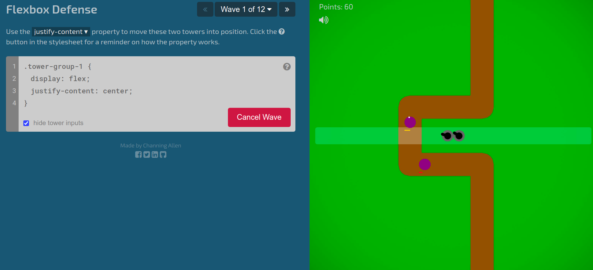

tower-group-1  
`justify-content: center;`

***
**Level 2/12:**

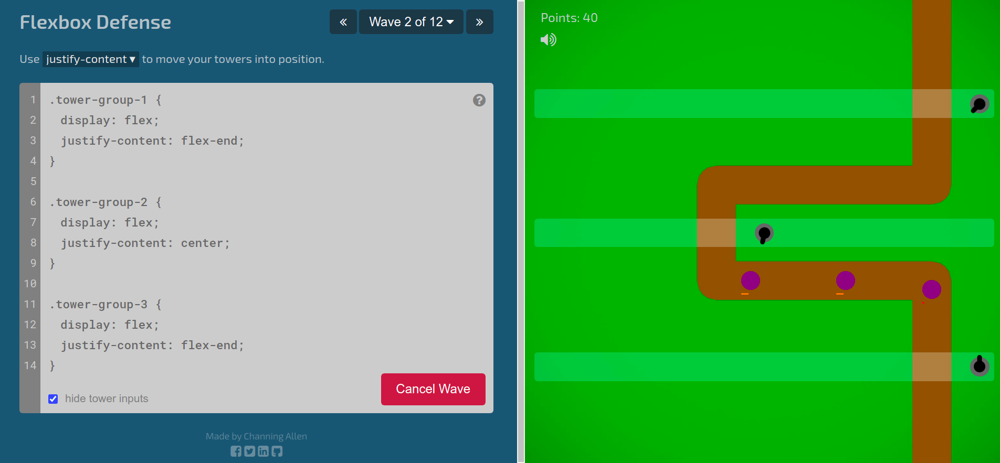

tower-group-1   
`justify-content: flex-end;` 

tower-group-2  
`justify-content: center;`

tower-group-3  
`justify-content: flex-end;`

***
**Level 3/12:**

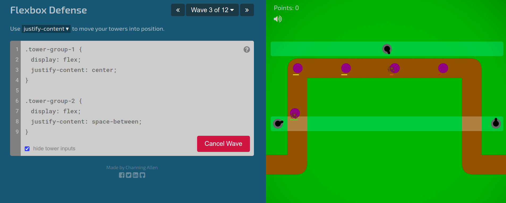

tower-group-1   
`justify-content: center;`

tower-group-2  
`justify-content: space-between;`

***
**Level 4/12:**

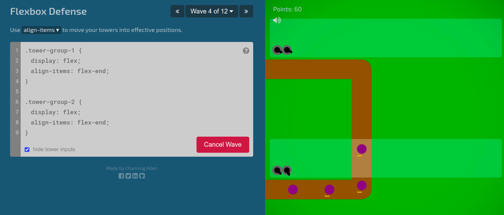

tower-group-1   
`align-items: flex-end;`

tower-group-2  
`align-items: flex-end;`

***
**Level 5/12:**

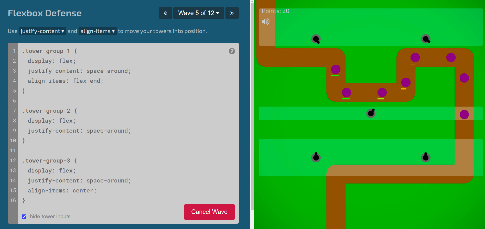

tower-group-1   
`justify-content: space-around;`
`align-items: flex-end;`

tower-group-2  
`justify-content: space-around;`

tower-group-3  
`justify-content: space-around;`
`align-items: center;`

***
**Level 6/12:**

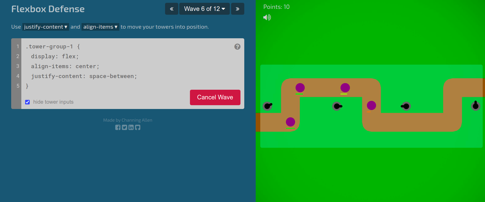

tower-group-1   
`align-items: center;`
`justify-content: space-between;`

***
**Level 7/12:**

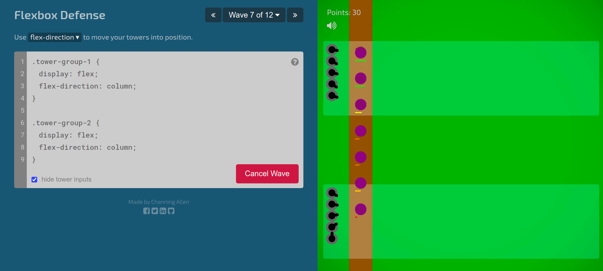

tower-group-1   
`flex-direction: column;`

tower-group-2  
`flex-direction: column;`

***
**Level 8/12:**

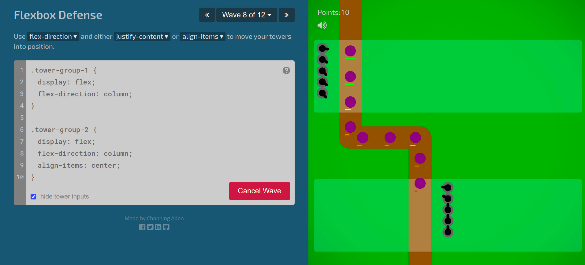

tower-group-1   
`flex-direction: column;`

tower-group-2  
`flex-direction: column;`
`align-items: center;`

***
**Level 9/12:**

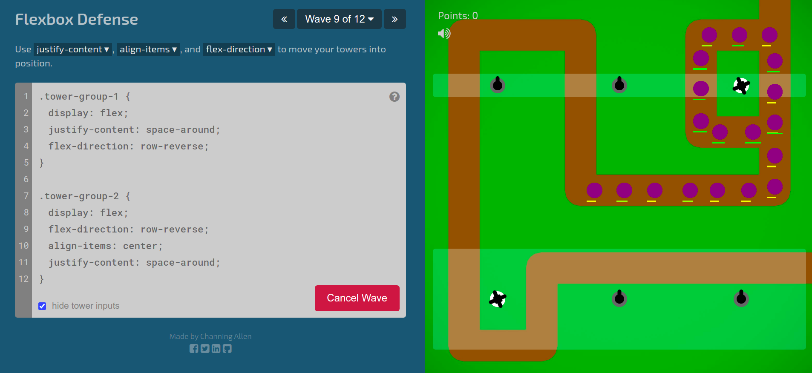

tower-group-1   
`justify-content: space-around;`
`flex-direction: row-reverse;`

tower-group-2  
`flex-direction: row-reverse;`
`align-items: center;`
`justify-content: space-around;`

***
**Level 10/12:**

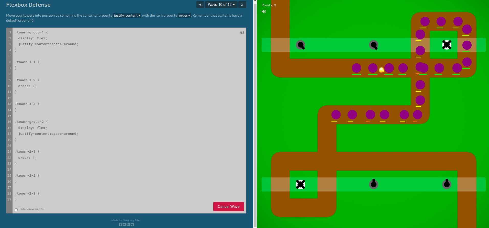

tower-group-1   
`justify-content: space-around;`

tower-1-2  
`order: 1;`

tower-group-2  
`justify-content: space-around;`

tower-2-1  
`order: 1;`

***
**Level 11/12:**

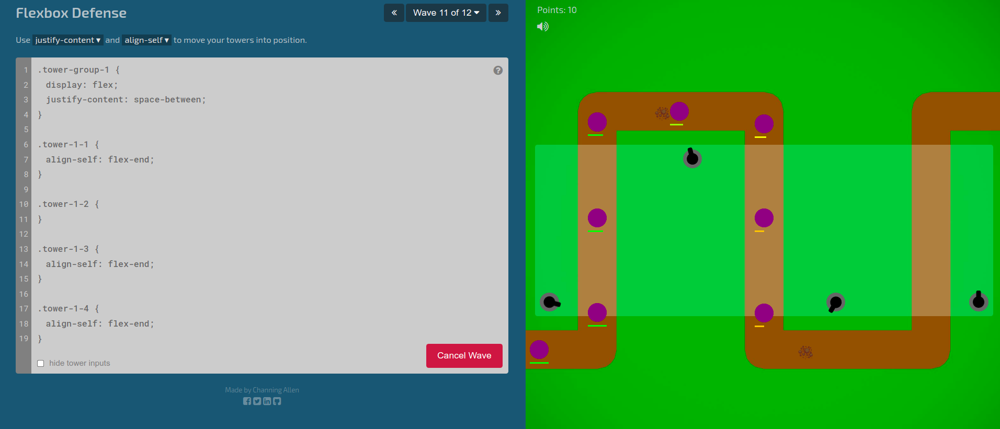

tower-group-1   
`justify-content: space-between;`

tower-1-1  
`align-self: flex-end;`

tower-1-3  
`align-self: flex-end;`

tower-1-4  
`align-self: flex-end;`

***
**Level 12/12:**

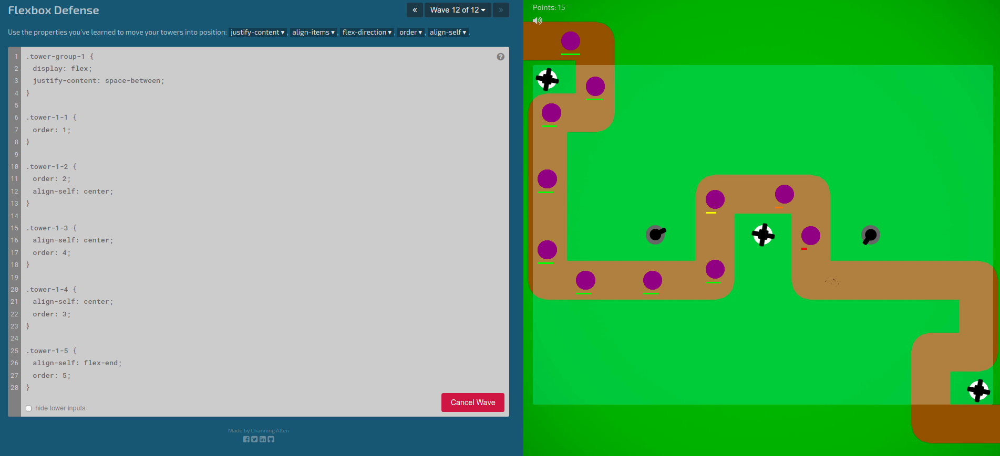

tower-group-1   
`justify-content: space-between;`

tower-1-1  
`order: 1;`

tower-1-2  
`order: 2;`
`align-self: center;`

tower-1-3  
`align-self: center;`
`order: 4;`

tower-1-4  
`align-self: center;`
`order: 3;`

tower-1-5  
`align-self: flex-end;`
`order: 5;`

***
